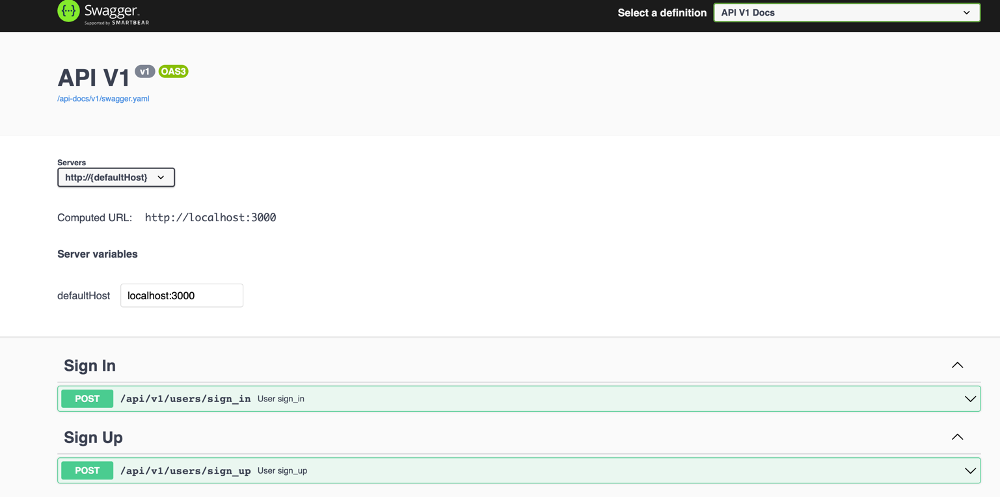
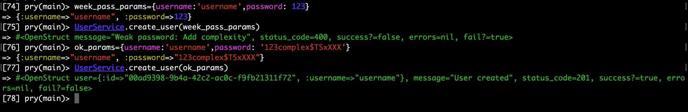

## Overall review

### Rrerequisites
* Ruby version 3.1.0
* Rails 7
* Redis-server

Swagger docs with request body http://localhost:3000/api-docs/index.html

User is able to signup and signin with `username` & `password`

Requests:

POST http://localhost:3000/api/v1/users/sign_up

POST http://localhost:3000/api/v1/users/sign_in

From `rails console`

**TODO**

What need to do to increase robustness of the app
- [ ] Add auth Header with ttl
- [ ] Apply CORS rules
- [ ] Build APIGetway to prevent ddos attacks
